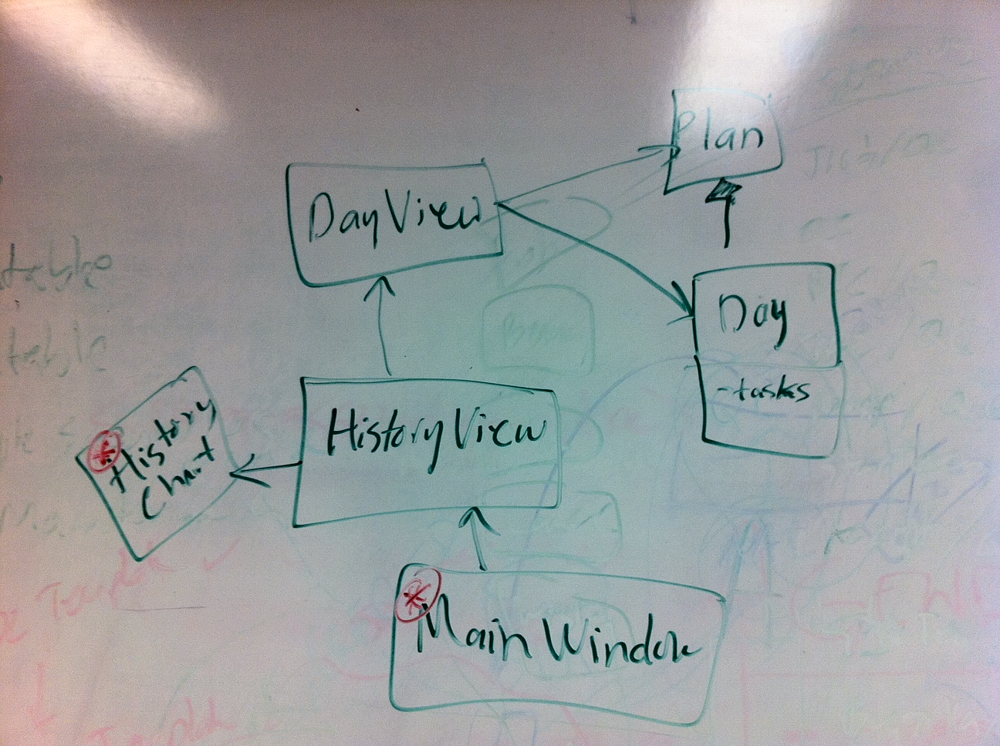
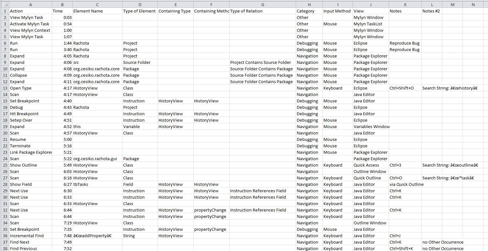

# Study Artifacts: Supporting Search and Navigation through Code Context Models

Thomas Fritz, Christoph Bräunlich, and David Shepherd conducted a study of twelve developers performing one of three change tasks using the Eclipse IDE for Java Developers. Here we publish the data collected during this study.  Our data consists of twelve transcripts of developer actions transcribed by hand from the approximately two hours of video collected from each participant. It also includes the patches they submitted as solutions and a drawing/description of the program elements and relationships necessary to complete their task. Further details on the study setup can be found in our paper (preprint coming soon). 

--
### **Task:** [#116 New task in History->Tasks not visible](http://sourceforge.net/p/rachota/bugs/116/)
**Project:** [Rachota](http://sourceforge.net/projects/rachota/), **Version:** 2.4, **Subjects:** R1, R2, R3, R4

--
### **Task:** [Save Failed - Data Loss Occurs - ID: 3420227](http://sourceforge.net/tracker/?func=detail&aid=3420227&group_id=7118&atid=107118)
**Project:** [Freemind](http://sourceforge.net/projects/freemind/), **Version:** 0.9.0 RC 15, **Subjects:** F1, F2, F3, F4

--
### **Task:** [#30 list position lost after sleep](http://sourceforge.net/p/jpwsafe/bugs/30/)
**Project:** [JPasswordSafe](http://sourceforge.net/projects/jpwsafe/), **Version:** 2.4, **Subjects:** J1, J2, J3, J4

--
## Example Developer Packet

Developer's model as she/he sees it

Transcript of developer's actions when working

    diff --git a/Rachota/src/org/cesilko/rachota/gui/HistoryView.java b/Rachota/src/org/cesilko/rachota/gui/HistoryView.java
    index 51a4d70..243c8ab 100644
    --- a/Rachota/src/org/cesilko/rachota/gui/HistoryView.java
    +++ b/Rachota/src/org/cesilko/rachota/gui/HistoryView.java
    @@ -36,6 +36,7 @@
     import java.util.Enumeration;
     import java.util.Iterator;
     import java.util.Vector;
    +
     import javax.swing.JMenuItem;
     import javax.swing.JOptionPane;
     import javax.swing.JPopupMenu;
    @@ -45,12 +46,20 @@
     import javax.swing.tree.DefaultMutableTreeNode;
     import javax.swing.tree.TreePath;
     import javax.swing.tree.TreeSelectionModel;
    +
     import org.cesilko.rachota.core.Day;
     import org.cesilko.rachota.core.Plan;
     import org.cesilko.rachota.core.Settings;
     import org.cesilko.rachota.core.Task;
     import org.cesilko.rachota.core.Translator;
    -import org.cesilko.rachota.core.filters.*;
    +import org.cesilko.rachota.core.filters.AbstractTaskFilter;
    +import org.cesilko.rachota.core.filters.DescriptionFilter;
    +import org.cesilko.rachota.core.filters.DurationFilter;
    +import org.cesilko.rachota.core.filters.IdleFilter;
    +import org.cesilko.rachota.core.filters.KeywordFilter;
    +import org.cesilko.rachota.core.filters.PriorityFilter;
    +import org.cesilko.rachota.core.filters.PrivateFilter;
    +import org.cesilko.rachota.core.filters.StateFilter;
     
     /** Panel providing history view on tasks from the past.
      * @author Jiri Kovalsky
    @@ -242,6 +251,7 @@
                         tbTasks.getColumnModel().getColumn(i).setHeaderValue(filteredTasksTableModel.getColumnName(i));
                 }
             });
    +        
         }
         
         /** Returns font that should be used for all widgets in this component
    @@ -1605,6 +1615,7 @@
             txtFilteredTime.setText(Tools.getTime(filteredTasksTableModel.getTotalTime()));
             historyChart.setDays(getDays());
             updateTotalTime();
    +        filterTasks();
         }
         
         public class MouseActionAdapter extends MouseAdapter implements ActionListener {

Patch containing developers' changes